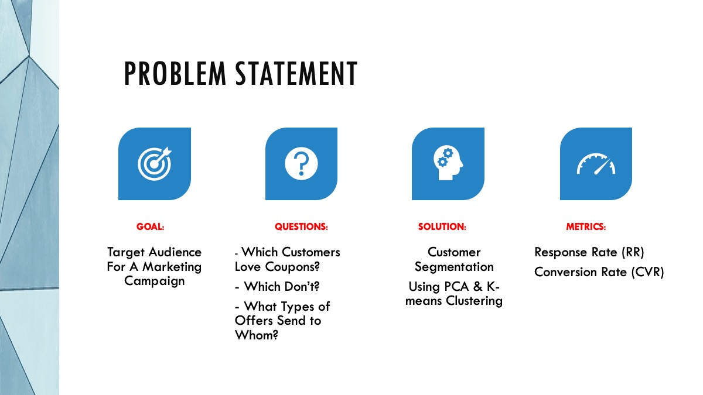
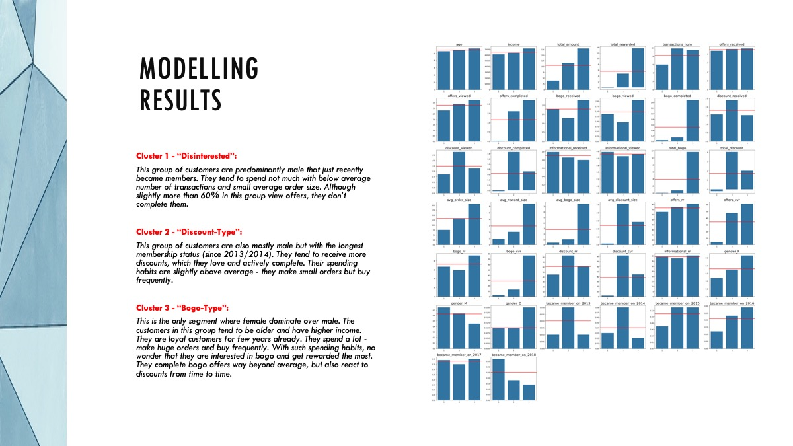

# Target Audience for Direct Marketing in Starbucks Rewards Mobile App

Hi,

My name is Katerina Bosko and this is my repo for the capstone project "Target Audience for Direct Marketing in Starbucks Rewards Mobile App". 

From Feb 2019 to Sept 2019 I completed a number of projects, including this, as part of [Udacity Data Science Nanodegree](https://www.udacity.com/course/data-scientist-nanodegree--nd025).

Jupyter notebooks for project: 
 - [`1_Starbucks_cleaning.ipynb`](https://github.com/k-bosko/Starbucks_rewards/blob/master/1_Starbucks_cleaning.ipynb) - cleaning, merging, aggregating steps
 - [`2_Starbucks_EDA.ipynb`](https://github.com/k-bosko/Starbucks_rewards/blob/master/2_Starbucks_EDA.ipynb) - explorative data analysis
 - [`3_Starbucks_modeling.ipynb`](https://github.com/k-bosko/Starbucks_rewards/blob/master/3_Starbucks_modeling.ipynb) - modeling part: imputing, one-hot encoding, scaling, clustering, results evaluation
 - [`4_Starbucks_refinement.ipynb`](https://github.com/k-bosko/Starbucks_rewards/blob/master/4_Starbucks_refinement.ipynb) - all the above steps refactored as functions. Modeling under different analytical assumptions

Technical Report: [HERE](https://github.com/k-bosko/Starbucks_rewards/blob/master/reports/Capstone_Technical_Report.pdf)
or on my blog - [https://www.cross-validated.com/Starbucks-Rewards-Program/](https://www.cross-validated.com/Starbucks-Rewards-Program/)

Presentation Slides: [HERE](https://github.com/k-bosko/Starbucks_rewards/blob/master/reports/Capstone_presentation.pdf)

For questions or comments, please feel free to reach out on [LinkedIn](http://linkedin.com/k-bosko/).

## Results

